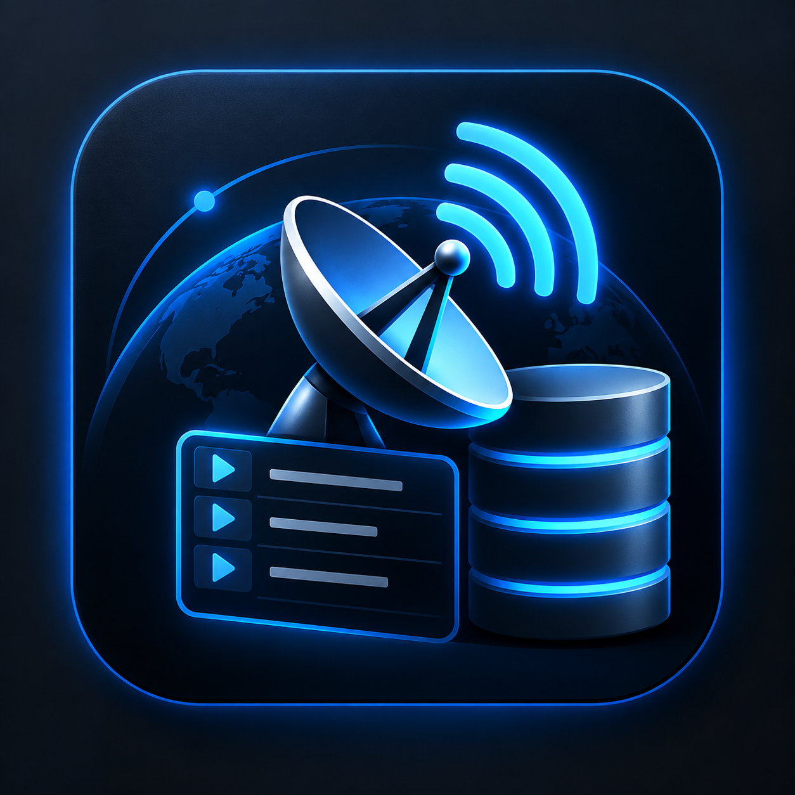

  

<h1 align="center">The_Channelizer</h1>

  <strong>Satellite Database Manager for Windows</strong> 
  Manage, inspect, organize, convert, merge and verify satellite receiver channel databases with a modern PyQt6 interface.

  
  
  
  
  

  <a href="https://t.me/The_Channelizer">Telegram</a> •
  <a href="https://github.com/nikkpap/The_Channelizer">GitHub</a> •
  <a href="mailto:nikkpap@gmail.com">Email</a>

✨ Overview

The_Channelizer is a desktop application for working with satellite receiver channel databases.

It gives you one clean interface to:

open and inspect receiver files

manage favorites and favorite groups

browse channel / transponder / satellite information

convert between supported formats

merge different receiver files

verify structure before saving

work more safely with automatic backups and a BOX-SAFE workflow

Goal: make receiver-file editing easier, cleaner and safer.

🚀 Highlights

📂 Auto-detects receiver files from content, not just extension

📺 Unified channel browser for TV and Radio

⭐ Favorites management with multi-selection support

🛰️ Satellite management for supported formats

ℹ️ Detailed Channel Info dialog

🔄 DB ↔ SDX ↔ CHL conversion

🧩 Mixed-format merge

✅ Built-in verifier

🛡️ BOX-SAFE save workflow

🌐 7 interface languages

🌙 System / Dark / Light themes

📐 Responsive UI with collapsible sidebar

📁 Supported Formats

Format

Extension

Support

SQLite Receiver Database

.db

✅

SDX Mode 1 — Binary + zlib

.sdx

✅

SDX Mode 2 — JSON stream

.sdx

✅

CHL JSON Stream Ver 1

.chl

✅

The format is detected from the file contents, not only from the extension.

🧰 Main Features

📺 Channel Browser

unified TV / Radio channel view

sortable table

search by channel, satellite, DB ID and order

visible favorite membership columns

responsive layout for smaller displays

⭐ Favorites

add/remove selected channels to favorite groups

multi-channel favorite editing

clear all favorites from selected channels

rename favorite groups

reorder favorite groups

open a dedicated favorites summary page

Shortcuts

1 ... 9 → toggle favorite slot 1 ... 9

Ctrl + F → focus search

F1 → open instructions

🛰️ Satellites

inspect satellites in the current receiver file

keep/delete satellites where safely supported

dependent cleanup for related records

protected workflow with backup and verification

Format notes

SQLite DB: supported

CHL: supported with re-indexing

SDX: deletion intentionally locked in v3.0 pending more validation

ℹ️ Channel Info

Double-click a channel or use the right-click menu to view:

channel details

transponder details

satellite details

favorites membership

Depending on the loaded format, available data can include:

Service ID

Video PID

PCR PID

PMT PID

provider

type

codec

lock / skip / hide state

receiver-specific values

📊 Summary

Quick receiver database counts, including:

satellites

transponders

channels

audio tracks

subtitles

favorite groups

favorite links

🔄 Converter

The built-in converter supports:

DB  → SDX
DB  → CHL

SDX → DB
SDX → CHL

CHL → DB
CHL → SDX

source format is auto-detected

generated output is verified

target file is reported only after a successful write/check cycle

Different receiver formats do not contain exactly the same fields, so conversion is structural, not byte-for-byte identical.

🧩 Merge

The_Channelizer can merge multiple receiver files using a common internal model.

Supported combinations

DB  + DB
DB  + SDX
DB  + CHL
SDX + SDX
SDX + CHL
CHL + CHL

Output

.db
.sdx
.chl

The merged file is verified automatically after creation.

✅ Verifier

The verifier performs format-specific checks before a file is considered ready.

SQLite DB

SQLite integrity check

required tables

required columns

schema compatibility

SDX

mode detection

header / object structure

relationship consistency

favorite references

CHL

Ver 1 structure

counts

continuous indexes

TP → satellite references

channel → TP references

favorite → channel references

🛡️ BOX-SAFE Workflow

Receiver files can be sensitive, so The_Channelizer uses a conservative write model.

What it does

verifies compatibility before changes

creates automatic backups before native edits

uses a temporary file during Save As

verifies output before replacing destination files

protects existing destination files with backup behavior

Save flow

Receiver data
    ↓
Temporary output
    ↓
Verification
    ↓
Backup existing destination
    ↓
Replace destination

Important: always keep an untouched original receiver export.

💾 Save As

The app uses Save As… instead of silently overwriting the working file.

Native extensions are preserved:

SQLite DB → .db
SDX       → .sdx
CHL       → .chl

After a successful save:

the output has been verified

the new file becomes the active file

the original file remains protected unless you intentionally overwrite it

🎨 Interface

The application includes:

System Auto

Dark

Light

It also includes:

responsive main layout

collapsible hamburger sidebar

compact sidebar mode

automatic sidebar collapse on smaller displays

horizontal scrolling for wide favorite layouts

Minimum usable size: approximately 820 × 560

🌐 Languages

The UI currently supports:

🇬🇧 English

🇬🇷 Ελληνικά

🇮🇹 Italiano

🇫🇷 Français

🇩🇪 Deutsch

🇷🇺 Русский

🇨🇳 中文

Language settings are stored and restored automatically.

🖥️ Requirements

Run from source

Windows 10 / 11

Python 3.11

PyQt6

Install PyQt6:

py -3.11 -m pip install PyQt6

Run:

py -3.11 The_Channelizer_v3.0.pyw

📦 Build EXE

Install tools:

py -3.11 -m pip install PyQt6 pyinstaller auto-py-to-exe

Launch:

auto-py-to-exe

Recommended setup

Option

Value

Script

The_Channelizer_v3.0.pyw

Name

The_Channelizer

Packaging

One File

Console

Window Based

Icon

The_Channelizer.ico

Version File

The_Channelizer_version_info.txt

Manifest

The_Channelizer.manifest

Clean

ON

Optimize

1

UPX

OFF

UAC Admin

OFF

Direct PyInstaller example

py -3.11 -m PyInstaller ^
  --noconfirm ^
  --clean ^
  --onefile ^
  --windowed ^
  --noupx ^
  --optimize 1 ^
  --name The_Channelizer ^
  --icon The_Channelizer.ico ^
  --version-file The_Channelizer_version_info.txt ^
  --manifest The_Channelizer.manifest ^
  The_Channelizer_v3.0.pyw

Output:

dist\The_Channelizer.exe

⚠️ Compatibility Note

Receiver database formats are often firmware-specific.

A file passing verification means it is structurally consistent with the currently implemented profile. It does not guarantee that every receiver or firmware version will accept it.

If you find a compatibility issue, please report:

receiver model

firmware version

source file type

operation performed

expected result

actual result / error

🤝 Community

ALU DEV TEAM @ 2026
Nikolaos K. Paridis シ (nikkpap)

📧 nikkpap@gmail.com

💬 Telegram — The_Channelizer

💻 GitHub — nikkpap/The_Channelizer

Open for discussions and ideas.

A public brainstorming is better than no brainstorming :) Cheers!

👨‍🔧 About the developer

Civil Engineer, with passion in Technology... home-projects, mods, and everything that needs further development...

📌 Current Version

The_Channelizer v3.0

❤️ Final Note

Keep your original receiver export, test generated files carefully, and share what you learn.

The_Channelizer — Satellite Database Manager
