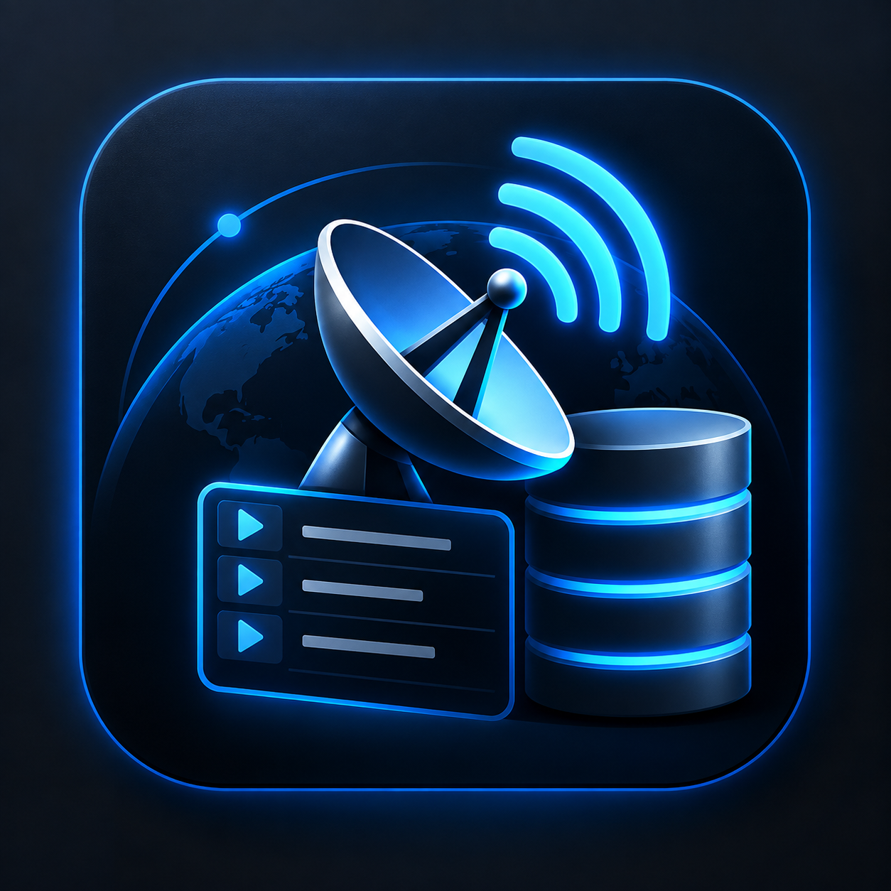

<p align="center">
  
</p>

<h1 align="center">The_Channelizer</h1>

<p align="center">
  <strong>Satellite Database Manager for Windows</strong><br>
  Manage, inspect, organize, convert, merge and verify satellite receiver channel databases with a modern PyQt6 interface.
</p>

<p align="center">
  <a href="https://github.com/nikkpap/The_Channelizer"></a>
  
  
  
  
</p>

<p align="center">
  <a href="https://t.me/The_Channelizer">Telegram</a> •
  <a href="https://github.com/nikkpap/The_Channelizer">GitHub</a> •
  <a href="mailto:nikkpap@gmail.com">Email</a>
</p>

---

## ✨ Overview

**The_Channelizer** is a desktop application for working with satellite receiver channel databases.

It gives you one clean interface to:

- open and inspect receiver files
- manage favorites and favorite groups
- browse channel / transponder / satellite information
- convert between supported formats
- merge different receiver files, or transfer favorites between them
- verify structure before saving
- work more safely with automatic backups and a **BOX-SAFE** workflow

> **Goal:** make receiver-file editing easier, cleaner and safer.

---

## 🚀 Highlights

- 📂 Detects receiver files from their content, not just the extension
- 📺 Unified channel browser for TV and Radio
- 🔎 Search by channel name, or by transponder frequency (`12169` or `12169,12800`)
- ⭐ Full Favorites Manager with multi-selection support
- ★ **Merge Favorites**: copy favorites from one receiver file onto another
- 🛰️ Satellite management, including deletion for DB, CHL and every SDX mode
- ℹ️ Detailed Channel Info dialog
- 🔄 DB ↔ SDX ↔ CHL conversion
- 🧩 Mixed-format merge
- 📡 **New in v3.5.0:** StarSat support as **SDX Mode 2A** (16 favorite groups)
- ✅ Built-in verifier
- 🛡️ BOX-SAFE save workflow
- 🌐 7 interface languages
- 🌙 System / Dark / Light themes
- 📐 Responsive UI with collapsible sidebar

---

## 📁 Supported Formats

| Format | Extension | Favorite groups | Support |
|---|---|---|---|
| SQLite Receiver Database (Tiger / GTMedia / Qviart) | `.db` | from the file (32+) | ✅ |
| SDX Mode 1 — Binary + zlib (MST, Viark) | `.sdx` | 26 | ✅ |
| SDX Mode 2 — JSON stream (MST) | `.sdx` | 26 | ✅ |
| **SDX Mode 2A — StarSat JSON / 16-FAV** | `.sdx` | 16 | ✅ **new** |
| CHL JSON Stream Ver 1 (Tiger, Viark, CHMax) | `.chl` | from the file | ✅ |

The format is detected from the file contents, not only from the extension. The status bar shows what was detected, for example `SDX1`, `SDX2`, `SDX2A`, `VIARK-CHL` or `CHMAX`.

### 📡 About SDX Mode 2A (StarSat)

StarSat files are Mode 2 JSON, but with a different receiver profile:

- **16** favorite groups instead of 26
- compact favorite lists that hold only the active entries
- compact audio and subtitle lists
- settings objects with plain names (`box_object` instead of `box_object_0`)

The_Channelizer recognizes them automatically, edits them exactly like Mode 2, and always keeps them in the StarSat layout.

---

## 🧰 Main Features

### 📺 Channel Browser

- unified TV / Radio channel view
- sortable table
- search by channel, satellite, DB ID and order
- **transponder frequency search**: enter one or more frequencies, separated by commas or spaces
- visible favorite membership columns (one per group)
- reorder and delete channels
- responsive layout for smaller displays

### ⭐ Favorites

- add/remove selected channels to favorite groups
- multi-channel favorite editing
- clear all favorites from selected channels
- **Favorites Manager**:
  - create, rename, delete, clear and reorder groups
  - copy or move members to another group
  - reorder members inside a group
- dedicated favorites summary page
- renamed SDX groups also update the receiver's name-change mask, so the receiver shows the new names

**Shortcuts**

| Key | Action |
|---|---|
| `1` … `9` | toggle favorite slot 1 … 9 |
| `Ctrl` + `F` | focus search |
| `F1` | open instructions |

### ★ Merge Favorites

Transfer favorites from one receiver file to another, across any formats (DB, CHL, SDX Mode 1 / 2 / 2A).

1. **Browse 1**: the **primary** file. Its channels, channel order and existing favorites are kept.
2. **Browse 2**: the **donor** file. Its favorites are copied.
3. **Save merged…**: choose a **new** output file. The output uses the primary file's format.

**How channels are matched.** Two channels match when they have the same satellite position and direction, polarization, service ID and TV/Radio type. The transponder frequency must also be within ±3 MHz and the symbol rate within ±10.

**How groups are chosen.** A donor group goes into the primary group with the **same name**. If there is none, it goes into an unused default slot (`Fav9`, `FAV 17` …). Groups that have no free slot are skipped and listed in the summary.

### 🛰️ Satellites

- inspect satellites in the current receiver file
- orbital positions shown as degrees with direction (`13.0°E`, `30.0°W`)
- keep/delete satellites with dependent cleanup of related records
- transponder and channel references are renumbered and verified
- protected workflow with backup and verification

| Format | Satellite deletion |
|---|---|
| SQLite DB | ✅ supported (large deletions run in batches) |
| CHL | ✅ supported with re-indexing |
| SDX Mode 1 / Mode 2 / Mode 2A | ✅ supported with TP / program / favorite repacking |

### ℹ️ Channel Info

Double-click a channel, or use the right-click menu, to view:

- channel details
- transponder details
- satellite details
- favorites membership

Depending on the loaded format, available data can include:

- Service ID
- Video PID, PCR PID, PMT PID
- provider
- type and codec
- lock / skip / hide state
- receiver-specific values

### 📊 Summary

Quick receiver database counts, including:

- satellites
- transponders
- channels
- audio tracks
- subtitles
- favorite groups
- favorite links

---

## 🔄 Converter

The built-in converter supports:

```text
DB  → SDX (Mode 1 / Mode 2 / Mode 2A)
DB  → CHL

SDX → DB
SDX → CHL

CHL → DB
CHL → SDX (Mode 1 / Mode 2 / Mode 2A)
```

- the source format is auto-detected
- the output is built in a temporary file and verified before it replaces anything
- warnings tell you what could not be carried over, for example:
  - extra favorite groups
  - favorite names shortened for SDX Mode 1
  - auxiliary (non-satellite) transponders

The **Settings → SDX output** option chooses the SDX variant:

| SDX output | Result |
|---|---|
| **Auto** | keeps the source family (a StarSat source stays StarSat); otherwise Mode 2 |
| **Mode 1** | Binary + zlib, 26 favorite groups |
| **Mode 2** | JSON, 26 favorite groups |
| **Mode 2A** | StarSat JSON, 16 favorite groups |

> Different receiver formats do not contain exactly the same fields, so conversion is **structural**, not byte-for-byte identical.

---

## 🧩 Merge

The_Channelizer can merge multiple receiver files using a common internal model.

**Supported combinations**

```text
DB  + DB
DB  + SDX
DB  + CHL
SDX + SDX
SDX + CHL
CHL + CHL
```

**Output**

```text
.db
.sdx   (Mode 1 / Mode 2 / Mode 2A)
.chl
```

- duplicate satellites, transponders and channels are combined
- favorite groups with the same name are merged
- populated groups come first when the target has fewer slots
- merging StarSat files with **Auto** keeps the StarSat layout
- the merged file is verified automatically after creation

The Converter and Merge never overwrite the file that is currently open in the main window.

---

## ✅ Verifier

The verifier performs format-specific checks before a file is considered ready.

**SQLite DB**

- SQLite integrity check
- required tables
- required columns
- schema compatibility

**SDX**

- mode and receiver-profile detection (Mode 1 / Mode 2 / Mode 2A)
- header / object structure
- relationship consistency
- favorite references
- StarSat structure: 16 groups, compact favorite lists, consistent audio / subtitle counts

**CHL**

- Ver 1 structure
- counts
- continuous indexes
- TP → satellite references
- channel → TP references
- favorite → channel references

Damaged files (for example invalid JSON after manual editing) are reported with the position of the error, and the file is not modified.

---

## 🛡️ BOX-SAFE Workflow

Receiver files can be sensitive, so The_Channelizer uses a conservative write model.

**What it does**

- verifies compatibility before changes
- creates automatic backups before native edits (SAFE mode)
- writes every output to a temporary file first
- verifies output before replacing destination files
- protects existing destination files with backup behavior
- reopens the previous file if a newly selected file cannot be loaded
- keeps unchanged files byte-for-byte identical on Save As (SDX and CHL)

**Save flow**

```text
Receiver data
    ↓
Temporary output
    ↓
Verification
    ↓
Backup existing destination
    ↓
Replace destination
```

If verification fails, the original file stays untouched.

**Backups**

| Setting | Value |
|---|---|
| Default folder | `%LOCALAPPDATA%\The_Channelizer\backups` |
| Backups kept per file | 5 by default (configurable) |
| Mode | SAFE (backups on) or NORMAL |

> ⚠️ **Important:** always keep an untouched original receiver export.

---

## 💾 Save As

The app uses **Save As…** instead of silently overwriting the working file.

Native extensions are preserved:

```text
SQLite DB → .db
SDX       → .sdx
CHL       → .chl
```

After a successful save:

- the output has been verified
- the new file becomes the active file
- the original file remains protected unless you intentionally overwrite it

---

## 🎨 Interface

The application includes three themes:

- System Auto
- Dark
- Light

It also includes:

- responsive main layout
- collapsible hamburger sidebar
- compact sidebar mode
- automatic sidebar collapse on smaller displays
- horizontal scrolling for wide favorite layouts
- drag & drop of `.db`, `.sdx` and `.chl` files
- "Open with…" support: start the app with a receiver file as its argument

**Minimum usable size:** approximately **820 × 560**

---

## 🌐 Languages

The UI currently supports:

- 🇬🇧 English
- 🇬🇷 Ελληνικά
- 🇮🇹 Italiano
- 🇫🇷 Français
- 🇩🇪 Deutsch
- 🇷🇺 Русский
- 🇨🇳 中文

Language settings are stored and restored automatically.

---

## 🖥️ Requirements

**Run from source**

- Windows 10 / 11
- Python 3.11
- PyQt6

Install PyQt6:

```bash
py -3.11 -m pip install PyQt6
```

Run:

```bash
py -3.11 The_Channelizer_v3_5_0.pyw
```

Open a receiver file directly:

```bash
py -3.11 The_Channelizer_v3_5_0.pyw "C:\path\to\Channels.sdx"
```

---

## 📦 Build EXE

Install tools:

```bash
py -3.11 -m pip install PyQt6 pyinstaller auto-py-to-exe
```

Launch:

```bash
auto-py-to-exe
```

**Recommended setup**

| Option | Value |
|---|---|
| Script | `The_Channelizer_v3_5_0.pyw` |
| Name | `The_Channelizer` |
| Packaging | One File |
| Console | Window Based |
| Icon | `The_Channelizer.ico` |
| Version File | `The_Channelizer_version_info_v3_5_0.txt` |
| Manifest | `The_Channelizer_v3_5_0.manifest` |
| Clean | ON |
| Optimize | 1 |
| UPX | OFF |
| UAC Admin | OFF |

**Direct PyInstaller example**

```bash
py -3.11 -m PyInstaller ^
  --noconfirm ^
  --clean ^
  --onefile ^
  --windowed ^
  --noupx ^
  --optimize 1 ^
  --name The_Channelizer ^
  --icon The_Channelizer.ico ^
  --version-file The_Channelizer_version_info_v3_5_0.txt ^
  --manifest The_Channelizer_v3_5_0.manifest ^
  The_Channelizer_v3_5_0.pyw
```

**Output:**

```text
dist\The_Channelizer.exe
```

---

## 🧪 Tested Receiver Exports (v3.5.0)

| Export | Format | Unchanged Save As | Edit / convert / merge |
|---|---|---|---|
| Qviart | SQLite DB (33 favorite groups) | same content | ✅ |
| MST | SDX Mode 1 | byte-identical | ✅ |
| Viark 4K | SDX Mode 1 | byte-identical | ✅ |
| MST (2 lists) | SDX Mode 2 | byte-identical | ✅ |
| StarSat | SDX Mode 2A | byte-identical | ✅ |
| Viark Satbox | CHL | byte-identical | ✅ |
| CHMax profile | CHL | byte-identical | ✅ |

For every file, these operations were run, and each result passed the verifier:

- favorites, including group renames with Greek names
- copying, moving and reordering group members
- reordering and deleting channels
- deleting satellites

Conversions between all formats, Merge and Merge Favorites were also tested on these files.

---

## ⚠️ Compatibility Note

Receiver database formats are often firmware-specific.

A file passing verification means it is **structurally consistent** with the currently implemented profile. It does **not** guarantee that every receiver or firmware version will accept it.

**Known limitations**

- SDX Mode 1 stores favorite group names in 16 bytes, so longer names are shortened (with a warning).
- Auxiliary (terrestrial / cable) transponders in SDX files are kept in native saves, but left out of cross-format conversion.
- The StarSat compact favorite layout follows the file structure. Test a file with a few favorites on the receiver first.

If you find a compatibility issue, please report:

- receiver model
- firmware version
- source file type
- operation performed
- expected result
- actual result / error

Enable **Debug Mode** in Settings and attach the log file. It helps a lot.

---

## 🗒️ What's New in v3.5.0

- 📡 **SDX Mode 2A (StarSat)**: full support everywhere, plus a new **SDX output → Mode 2A** option
- 🛰️ Viark SDX Mode 1 satellite positions and West direction are now read correctly
- 🔤 Greek and other non-Latin names are kept in SDX Mode 1
- ↔️ CHL West satellites (`3300` = `30.0°W`) are read, written and displayed correctly
- ★ Merge Favorites skips groups without a free slot instead of stopping
- 🛡️ Safer Convert / Merge, recovery after a failed open, and clear messages for damaged files

See the full **CHANGELOG** for details.

---

## 🤝 Community

**ALU DEV TEAM @ 2026**  
**Nikolaos K. Paridis シ (nikkpap)**

- 📧 [nikkpap@gmail.com](mailto:nikkpap@gmail.com)
- 💬 [Telegram — The_Channelizer](https://t.me/The_Channelizer)
- 💻 [GitHub — nikkpap/The_Channelizer](https://github.com/nikkpap/The_Channelizer)

Open for discussions and ideas.

> *A public brainstorming is better than no brainstorming :) Cheers!*

---

## 👨‍🔧 About the developer

Civil Engineer, with passion in Technology... home-projects, mods, and everything that needs further development...

---

## 📌 Current Version

**The_Channelizer v3.5.0**

---

## ❤️ Final Note

Keep your original receiver export, test generated files carefully, and share what you learn.

<p align="center"><strong>The_Channelizer — Satellite Database Manager</strong></p>
